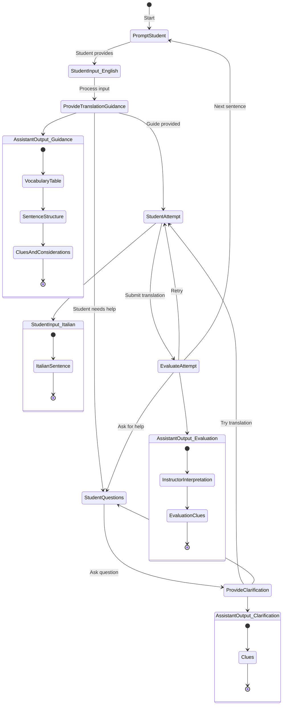

# Learning Journal Claude
## Italian Sentence Constructor

# Prompt document
## v001
#3 v001 initial creation of prompt and readme. Prompt copied from chatgpt folder
### Response Evaluation

- create architectural state diagram
- Claude can take the state diagram from draw.io as an XML export file and use that to create a Mermaid style text flowchart that it can then use to help construct the workflow for the prompt.
- Here's what the conversion of the architectural state diagram PNG file would look like when converted to Mermaid



- Here's the breakdown of the workflow that can be used as a base in our prompt.
```

1. Main workflow:
   - Starting with prompting the student
   - Handling student input in English
   - Providing translation guidance
   - Managing student questions and clarifications
   - Evaluating translation attempts

2. Nested states for assistant outputs:
   - Translation guidance (vocabulary, structure, clues)
   - Clarification responses
   - Evaluation feedback

3. Key decision points:
   - Student can ask questions at multiple points
   - Student can retry translations
   - Process can loop back to start for new sentences

```
- given the mermaid and the main workflow I asked Claude to write a prompt template leaving places for me to add specific informatoin for the processes/components in the state diagram. I will include this as a new prompt.md file, called claude-prompt.md

## v002
#3 v002 create a new prompt with the help of Claude based on the architecture state diagram

### Response Evaluation

## v003
#3 v003 fill in the placeholders in the new prompt from the old prompt
- fill in the placeholders in the new prompt
- copy them from the original prompt, may need to define them separately...
```
### B. Feedback Structure
[DEFINE YOUR FEEDBACK FORMAT HERE]
- How to organize feedback points
- Balance of positive and corrective feedback
- What type of examples to provide
```
- will remove for now, need to think about this part

- will also remove the Special Handling Cases for now.
```
Special Handling Cases

### Common Scenarios:
- When student attempts are completely off-track
- When students ask for direct translations
- When cultural context is crucial
- When dealing with idiomatic expressions

### Error Patterns:
- How to address recurring mistakes
- When to suggest review of basic concepts
- How to handle multiple errors in one attempt
```