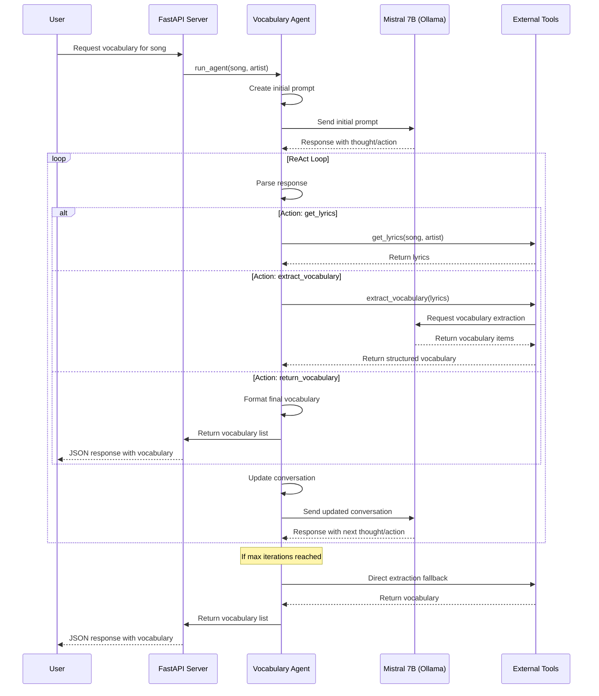

# Mistral Agent Architecture

## Overview

This document describes the architecture of our ReAct agent implementation using the Mistral 7B model through Ollama. The agent is designed to extract vocabulary from song lyrics for Japanese language learning.

## System Architecture

```
┌─────────────────┐     ┌──────────────────┐     ┌────────────────┐
│                 │     │                  │     │                │
│  FastAPI Server │────▶│  Vocabulary      │────▶│  Mistral 7B    │
│                 │     │  Agent           │     │  (via Ollama)  │
│                 │◀────│                  │◀────│                │
└─────────────────┘     └──────────────────┘     └────────────────┘
                               │   ▲
                               │   │
                               ▼   │
                        ┌──────────────────┐
                        │                  │
                        │  External Tools  │
                        │  - Lyrics Search │
                        │  - Vocabulary    │
                        │    Extraction    │
                        │                  │
                        └──────────────────┘
```

## Components

### 1. FastAPI Server

- **Purpose**: Provides HTTP endpoints for the vocabulary generation service
- **API Endpoints**:
  - `/api/v1/vocab-generator`: Main endpoint for generating vocabulary from songs
  - `/api/v1/cache`: Endpoint for listing all songs and artists in the cache
  - Swagger UI available at `/docs`
  - ReDoc available at `/redoc`
- **Functionality**: 
  - Accepts requests with song and artist information
  - Returns structured vocabulary data
  - Provides cache visibility for debugging and monitoring
  - Handles errors and provides appropriate responses

### 2. Vocabulary Agent

- **Purpose**: Orchestrates the process of finding lyrics and extracting vocabulary
- **Implementation**: Uses a ReAct (Reasoning + Acting) pattern with the following components:
  - **Agent State Management**: Tracks the current state of the agent, including lyrics, vocabulary, and errors
  - **Conversation Management**: Maintains the conversation history with the model
  - **Response Parsing**: Extracts structured information from the model's free-text responses
  - **Tool Execution**: Calls the appropriate tools based on the model's decisions

### 3. Mistral 7B Model (via Ollama)

- **Purpose**: Provides the reasoning capabilities for the agent
- **Integration**: Accessed through the Ollama API
- **Prompt Engineering**: Custom prompts guide the model to follow the ReAct pattern
- **Limitations**: No native function calling support (see [tool_calling.md](tool_calling.md))

### 4. External Tools

- **Lyrics Search Tool**:
  - **Purpose**: Finds lyrics for a given song and artist
  - **Implementation**: Uses web search and scraping to find lyrics
  - **Error Handling**: Provides fallbacks when lyrics cannot be found

- **Vocabulary Extraction Tool**:
  - **Purpose**: Extracts vocabulary items from lyrics
  - **Implementation**: Uses the Mistral model to identify vocabulary items
  - **Structured Output**: Formats vocabulary as JSON with kanji, romaji, and English translations

## Data Flow

1. **Request Initiation**:
   - User sends a request with song and artist information
   - FastAPI server validates the request and calls the agent

2. **Agent Initialization**:
   - Agent creates an initial prompt with the song and artist information
   - Agent initializes the conversation with the model

3. **ReAct Loop**:
   - Agent sends the current conversation to the model
   - Model generates a response with thought, action, and action input
   - Agent parses the response to extract structured information
   - Agent executes the selected tool with the provided inputs
   - Agent adds the tool's response to the conversation
   - Loop continues until a final answer is reached or maximum iterations is exceeded

4. **Result Processing**:
   - Agent extracts the final vocabulary list from the model's response
   - Agent formats the vocabulary as structured JSON
   - FastAPI server returns the vocabulary to the user

## Sequence Diagram



## Error Handling

- **Model Response Parsing**: Robust regex and JSON parsing to handle various response formats
- **Tool Execution**: Try-except blocks around tool execution with informative error messages
- **Maximum Iterations**: Fallback to direct extraction if maximum iterations are reached
- **Vocabulary Minimum**: Fallback mechanisms to ensure at least 5 vocabulary items are returned
- **Ollama Connection**: Helpful error messages for common Ollama issues (e.g., missing models)

## Implementation Details

### Key Files

- **agent.py**: Main implementation of the ReAct agent
- **prompt.py**: Defines the prompts used to guide the model
- **tools.py**: Implements the external tools used by the agent

### Agent State

The agent maintains a state dictionary with the following keys:
- **lyrics**: The lyrics of the song (if found)
- **vocabulary**: The extracted vocabulary items
- **errors**: Any errors encountered during execution

### Tool Definitions

Tools are defined in a dictionary with the following structure:
```python
TOOLS = {
    "get_lyrics": get_lyrics,
    "extract_vocabulary": extract_vocabulary,
    "return_vocabulary": return_vocabulary
}
```

Each tool is a function that takes inputs and returns a dictionary with results or error information.

### Detailed Tool Implementations

#### 1. Lyrics Search Tool (`get_lyrics.py`)

**Purpose**: Searches for and retrieves lyrics for a given song and artist.

**Libraries Used**:
- `duckduckgo_search`: Used to search for lyrics on the web
- `typing`: For type annotations

**Implementation Details**:
- Constructs a search query using the song name and artist
- Uses DuckDuckGo search API to find relevant lyrics
- Extracts the most relevant result and formats it as structured data
- Includes error handling for cases where lyrics cannot be found

**Return Format**:
```python
{
    "success": True/False,
    "lyrics": "Song lyrics text",
    "metadata": {
        "title": "Song title",
        "artist": "Artist name",
        "source": "URL source"
    }
}
```

#### 2. Vocabulary Extraction Tool (`extract_vocab.py`)

**Purpose**: Extracts Japanese vocabulary from song lyrics using the Mistral 7B model, supporting both Japanese and English input lyrics.

**Libraries Used**:
- `ollama`: Client for interacting with the local Ollama instance
- `instructor`: For structured output generation from LLMs
- `pydantic`: For data validation and schema definition
- `logging`: For error and debug logging
- `json`: For JSON serialization/deserialization

**Implementation Details**:
- **Language Handling**:
  - **Japanese Lyrics**: Extracts vocabulary directly from the Japanese text
  - **English Lyrics**: Identifies nouns, verbs, and adjectives, then translates them to Japanese
- Limits lyrics to a maximum of 400 words for efficient processing
- Ensures exactly 5 vocabulary items are returned for all songs
- Defines Pydantic models for structured vocabulary output:
  - `Part`: Individual kanji/kana characters with romaji
  - `VocabularyItem`: Complete vocabulary word with kanji, romaji, English, and parts
  - `VocabularyResponse`: Collection of vocabulary items
- Creates a detailed prompt with language-specific instructions for the model
- Uses a lower temperature (0.5) for more consistent results
- Provides clear formatting examples to ensure proper JSON structure
- Uses Instructor to patch the Ollama client for structured output generation
- Processes the model's response into a standardized format regardless of input language
- Includes specific error handling for missing Ollama models

**Return Format**:
```python
{
    "success": True/False,
    "vocabulary": [
        {
            "kanji": "レモン",
            "romaji": "remon",
            "english": "lemon",
            "parts": [
                {"kanji": "レ", "romaji": ["re"]},
                {"kanji": "モ", "romaji": ["mo"]},
                {"kanji": "ン", "romaji": ["n"]}
            ]
        },
        ... # Can return up to 400 vocabulary items
    ]
}
```

#### 3. Vocabulary Return Tool (`return_vocab.py`)

**Purpose**: Formats vocabulary data into the required JSON structure for API responses.

**Libraries Used**:
- `typing`: For type annotations

**Implementation Details**:
- Takes the output from the vocabulary extraction tool
- Validates the data structure
- Formats it into the final API response format
- Handles error cases where vocabulary is missing or extraction failed

**Return Format**:
```python
{
    "vocabulary": [
        {
            "kanji": "日本語",
            "romaji": "nihongo",
            "english": "Japanese language",
            "parts": [...]
        },
        ...
    ]
}
```

Or in case of error:
```python
{
    "error": "Error message"
}
```

## Conclusion

This architecture provides a flexible and robust approach to vocabulary extraction using the Mistral 7B model, despite the lack of native function calling support. The ReAct pattern allows the model to reason about the problem and select appropriate actions, while the agent handles the execution of those actions and maintains the conversation state.

Future improvements could include:
- Enhanced parsing logic for more reliable extraction of structured information
- Integration with models that support native function calling
- Additional tools for more comprehensive vocabulary information (e.g., example sentences, JLPT levels)
